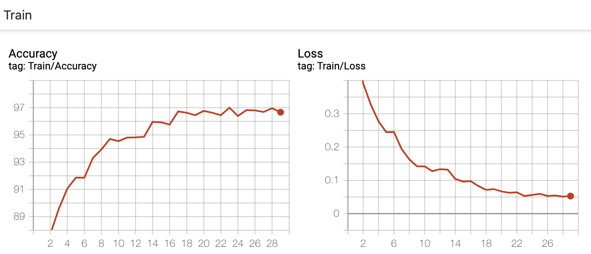

# Классификатор тегов (PyTorch, ResNet50)   

Задача:   
Классификатор места продаж: основное, холодильник, дополнительное, касса, паллета и т.п.     
Всего картинок: 5670 картинок, 5 классов. (Train 5103 / Valid 567)   
   
Характеристики:   
```
model: ResNet50
batch: 64
epoch: 30
lr: 0.001 и меньше
augmentation: RandomHorizontalFlip, brightness, contrast, saturation, RandomGrayscale.
```

    
    
    

Точность по классам на Valid:   
```
0.99 DMP_BRAND_STOYKA (141/143)
0.96 DMP_BRAND_XO (65/68)
0.62 DMP_PALLETA (24/39)
0.75 KOROB (43/57)
0.94 OMP (244/260)
mean accuracy: 0.91 (517/567)
```

Примеры правильной и ошибочной классификации:   
    
    
    
    
    
    
